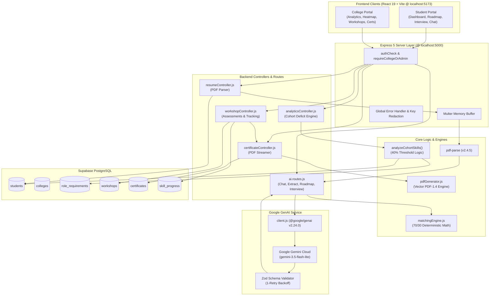

# Campus2Career AI

> **From Skill Gaps to Industry Readiness**  
> *An Enterprise Career Intelligence & Institutional Placement Enablement Platform*

[](https://react.dev/)
[](https://expressjs.com/)
[](https://tailwindcss.com/)
[](https://supabase.com/)
[](https://ai.google.dev/)
[](#-security--governance)

---

## 📌 Executive Summary

**Campus2Career AI** is a dual-portal career enablement and institutional placement platform that bridges the disconnect between university curricula and enterprise hiring standards. 

University students often prepare for campus placements without objective data regarding their role qualification, which competencies they lack, or how to demonstrate those skills in technical interviews. Simultaneously, college placement cells lack quantitative visibility into cohort-wide deficiencies, organizing generic campus training rather than addressing specific skill gaps.

Campus2Career solves this by creating a **closed-loop feedback system**:
1. **For Students**: The platform parses unstructured PDF resumes, extracts verified technical competencies using Google Gemini, evaluates deterministic qualification scores against enterprise roles, and delivers personalized 7-day adaptive learning sprints, technical mock interviews, and AI coaching.
2. **For Colleges**: The platform aggregates real-time cohort competency data, visualizes campus skill distributions via interactive heatmaps, triggers automated alerts when a skill deficit exceeds 40%, and provides targeted online video workshops that auto-issue verified institutional credentials upon assessment completion.

---

## 🔄 The Closed-Loop Placement Journey

```
                     STUDENT PORTAL                          COLLEGE PORTAL
                     ──────────────                          ──────────────
                  [Upload PDF Resume]
                           │
                           ▼
                  [AI Skill Extraction]
                 (Google Gemini 3.5 Lite)
                           │
                           ▼
                 [Role Match Scoring] ───────────────► [Cohort Aggregation]
               (70% Core / 30% Secondary)             (Supabase PostgreSQL)
                           │                                   │
                           ▼                                   ▼
                 [Diagnosed Skill Gaps]              [Campus Skill Heatmap]
                 (e.g., Lacks Power BI)               (Interactive Recharts)
                           │                                   │
                           ▼                                   ▼
                 [Adaptive 7-Day Sprint]             [40% Deficit Alert Trigger]
                 (Personalized Roadmap)               ("67.9% lack Power BI")
                           │                                   │
                           ▼                                   ▼
                 [AI Mock Interview Arena]          [Targeted Video Workshop]
                 (4-Rubric Answer Scoring)           (Masterclass Video 1 & 2)
                           │                                   │
                           └─────────────────┬─────────────────┘
                                             │
                                             ▼
                             [Post-Workshop Assessment]
                               (Passing Score: >= 70%)
                                             │
                                             ▼
                             [Vector PDF Certificate]
                            (Auto-Issued Institutional Credential)
```

---

## ✨ Platform Capabilities by User Role

### 🎓 1. Student Career Intelligence Portal
- **Automated Resume Ingestion**: Upload standard PDF resumes to extract verified programming languages, frameworks, databases, and engineering tools without manual data entry.
- **Deterministic Role Qualification**: Compare current competencies against enterprise profiles (e.g., *Data Analyst*, *Full Stack Developer*, *DevOps Engineer*) using a transparent 70/30 scoring model.
- **"What-If" Career Simulator**: Model the strategic value of learning a hypothetical skill (e.g., *"What happens if I learn Docker?"*) with instant score deltas and AI-generated career leverage analysis.
- **Adaptive 7-Day Learning Roadmaps**: Generate day-by-day learning tasks, practice challenges, and time budgets tailored to individual skill gaps.
- **AI Technical Interview Arena**: Practice with scenario-based technical questions and receive multi-rubric evaluation (technical accuracy, problem-solving, real-world application, communication) with diagnostic concept breakdowns.
- **Interactive AI Placement Coach**: Access an always-available floating assistant that synthesizes student readiness metrics into personalized placement guidance.
- **Masterclass Video Workshops**: Watch embedded industry video masterclasses, complete verification quizzes, and earn downloadable vector PDF credentials.

### 🏛️ 2. Institutional Placement Cell Portal
- **Campus Competency Dashboard**: Monitor cohort-wide readiness scores, registration trends, and candidate distribution across engineering tracks.
- **Interactive Campus Skill Heatmap**: Inspect stacked bar charts visualizing low, medium, and high proficiency distributions across 12 canonical industry skills.
- **Automated 40% Deficit Alerts**: Receive high-priority warnings when 40% or more students in a cohort lack a critical skill, complete with one-click workshop recommendations.
- **Two-Card Executive Alert View**: Avoid dashboard clutter through an intelligent filter displaying strictly the top critical deficit skill alongside the healthiest campus competency.
- **Workshop Management**: Schedule and manage video-based training bootcamps aligned with diagnosed campus gaps.
- **Student Audit Logs & Credential Registry**: Review issued student certificates, assessment scores, and cryptographic verification hashes.

### 🏢 3. Corporate Hiring Console
- **Industry Requisition Mapping**: Review standardized role definitions and required core/secondary skill breakdowns.
- **Requirement Publishing**: Publish hiring benchmarks to ensure university curricula stay aligned with corporate hiring needs.

---

## 🏛️ System Architecture & Hybrid Design

Campus2Career uses a **hybrid architecture** that pairs Generative AI with deterministic software engineering:



### Why a Hybrid Architecture?
| Architectural Function | Implementation Method | Engineering Rationale |
| :--- | :--- | :--- |
| **Unstructured Resume Parsing** | **Generative AI** (Gemini) | Resumes exhibit infinite layout and phrasing variations that static regex or rigid templates fail to capture. |
| **Adaptive Learning Sprints** | **Generative AI** (Gemini) | Generating balanced 7-day curricula tailored to diverse skill gaps requires generative reasoning. |
| **Interview Answer Evaluation** | **Generative AI** (Gemini) | Grading open-ended answers across technical accuracy and communication requires semantic comprehension. |
| **Conversational Career Coach** | **Generative AI** (Gemini) | Synthesizing dynamic student metrics into conversational guidance requires natural language synthesis. |
| **Role Qualification Scoring** | **Deterministic Logic** (JS) | Qualification scores (70% core + 30% secondary) must be **100% reproducible, explainable, and hallucination-free**. |
| **Cohort Deficit Calculations** | **Deterministic Logic** (JS) | Calculating institutional deficits `((lacking / total) * 100)` must be mathematically exact. |
| **Institutional 40% Deficit Alerts** | **Deterministic Logic** (JS) | Alert triggering is a strict conditional check (`deficit >= 40`) preventing false-positive institutional interventions. |
| **Student Access Control (RBAC)** | **Deterministic Logic** (Express) | Enforcing read-only access for students on college resources requires rigid HTTP 403 Forbidden middleware enforcement. |
| **Vector PDF Certificate Stream** | **Deterministic Logic** (Node.js) | Rendering authentic, millimetric landscape A4 credentials requires vector drawing operators, not an LLM. |

---

## 🛠️ Complete Technical Stack

| Layer | Technology | Version | Purpose in Platform |
| :--- | :--- | :--- | :--- |
| **Frontend Framework** | **React** | `^19.2.8` | High-performance component architecture, hooks, and context state management. |
| **Build & Tooling** | **Vite** | `^6.4.3` | Instant cold-start development server and optimized ES module bundling. |
| **Routing** | **React Router DOM** | `^7.18.4` | Declarative multi-portal client routing and protected route role guards. |
| **Styling** | **Tailwind CSS** | `^3.4.19` | Modern utility-first CSS styling and responsive enterprise layout tokens. |
| **Visualizations** | **Recharts** | `^3.10.1` | Native SVG-rendered stacked bar charts for cohort skill heatmaps. |
| **Backend Runtime** | **Node.js** | `>=18.0.0` | High-throughput asynchronous event-driven JavaScript server runtime. |
| **Backend Framework** | **Express.js** | `^5.2.1` | REST API routing, session management, and middleware orchestration. |
| **AI Provider** | **Google Gemini** | `gemini-3.5-flash-lite` | Ultra-low latency Large Language Model used for semantic extraction and coaching. |
| **AI SDK** | **@google/genai** | `^2.24.0` | Official next-generation Google GenAI client library with native JSON mode. |
| **Schema Validation** | **Zod** | `^4.6.5` | Strict runtime validation for API request bodies and AI structured outputs. |
| **Database** | **Supabase PostgreSQL** | `^2.116.0` | Managed cloud PostgreSQL with relational schemas, foreign keys, and indexes. |
| **File Processing** | **Multer** | `^2.4.0` | In-memory stream buffering (`memoryStorage`) for secure PDF uploads. |
| **Document Parsing** | **pdf-parse** | `^2.4.5` | In-memory text extraction converting uploaded PDF buffers to clean plaintext. |
| **PDF Generation** | **Vector PDF Engine** | Custom | Zero-dependency pure Node.js RFC-compliant vector PDF-1.4 landscape generator. |

---

## 🔒 Security & Governance

- **Server-Side API Key Isolation**: The `GEMINI_API_KEY` and database service credentials reside exclusively in `backend/.env`. The frontend bundle contains zero references to privileged keys.
- **In-Memory Upload Pipeline**: Uploaded PDF resumes reside in RAM only during text extraction and are discarded immediately. No unencrypted student files are written to local disk.
- **Strict Role-Based Access Control (RBAC)**: Express middleware (`requireCollegeOrAdmin`) strictly intercepts student attempts to mutate institutional data, returning an immediate **HTTP 403 Forbidden**.
- **Error Log Sanitization**: All error handlers redact sensitive API tokens: `(err.message || '').replace(apiKey, '[REDACTED_API_KEY]')`.
- **Defensive Retries & Fallbacks**: The AI client implements a 1-retry exponential backoff loop for JSON parsing. If the external AI service experiences rate limits (HTTP 429) or outages, pre-structured fallback curricula and keyword-matching evaluation handlers maintain 100% application uptime.

---

## 🚀 Getting Started & Local Setup

### Prerequisites
- **Node.js**: `v18.0.0` or higher
- **npm**: `v9.0.0` or higher
- **Google Gemini API Key**: [Get a Gemini API Key](https://aistudio.google.com/)
- **Supabase Project**: [Create a free Supabase project](https://supabase.com/)

### 1. Clone & Configure Environment
```bash
git clone https://github.com/HackSpectra/HS112-Femora.git
cd HS112-Femora
```

#### Backend Environment (`backend/.env`)
Create `backend/.env` with your credentials:
```env
PORT=5000
CLIENT_URL=http://localhost:5173
GEMINI_API_KEY=your_actual_gemini_api_key_here
GEMINI_MODEL=gemini-3.5-flash-lite
SUPABASE_URL=https://your-project.supabase.co
SUPABASE_SERVICE_ROLE_KEY=your_supabase_service_role_key_here
COLLEGE_ALERT_THRESHOLD=40
WORKSHOP_PASSING_SCORE=70
```

### 2. Run Database Migrations
Execute the SQL commands in `backend/schema.sql` and `backend/seed.sql` inside your Supabase SQL Editor to create tables, indexes, and triggers.

### 3. Start Backend Server
```bash
cd backend
npm install
npm start
```
*Backend runs on `http://localhost:5000` (Health check: `http://localhost:5000/api/health`).*

### 4. Start Frontend Client
In a new terminal:
```bash
cd frontend
npm install
npm run dev
```
*Frontend runs on `http://localhost:5173`.*

---

## 🔑 Demo Access & Testing Portals

The application includes pre-configured access for instant evaluation without manual setup:

| Portal | URL Path | Access Mode | Purpose |
| :--- | :--- | :--- | :--- |
| **Student Portal** | `http://localhost:5173/student` | Authenticated / Demo | Resume upload, gap diagnosis, roadmap, AI interview, AI Coach. |
| **College Portal** | `http://localhost:5173/college/dashboard` | Authenticated / Read-Only | Institutional analytics, Campus Skill Heatmap, 40% Deficit Alerts. |
| **Workshops Arena** | `http://localhost:5173/college/workshops` | All Users | Video masterclasses, verification assessments, PDF certificates. |
| **Company Console** | `http://localhost:5173/company/requirements` | Recruiter | Industry requisition definitions and hiring benchmarks. |

---

## 📚 Dedicated Documentation Index

For in-depth evaluation and academic review, refer to the specialized documentation files:

* 📄 **[`AI_USAGE.md`](./AI_USAGE.md)** — Comprehensive Generative AI implementation guide covering prompts, Gemini architecture, structured JSON schemas, hybrid logic, and stateless chat verification.
* 📄 **[`API_SEC.md`](./API_SEC.md)** — Complete REST API reference, request/response JSON contracts, Bearer JWT authentication, and RBAC security specifications.
* 📄 **[`RULES.md`](./RULES.md)** — Authoritative business rules, scoring formulas, deficit thresholds, and architectural invariants.

---

## 📝 Important Verification Statement

> This project documentation describes functionality based strictly on the current implementation of the Campus2Career codebase. Features that are not implemented in the source code (such as persistent database chat memory or vector embeddings) are explicitly documented as absent to ensure factual accuracy and technical integrity.
